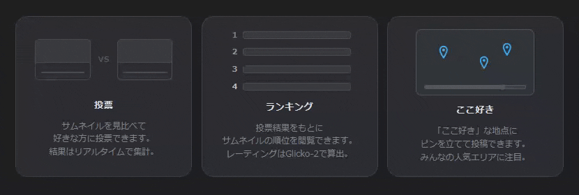

# ラブ♥ねいる

いわゆるサムネを格付けするツール

**<https://vote-thumbnail.pages.dev/>**

---

## 機能

### 一覧

- グリッド / ギャラリー表示切り替え
- ソート：**日付・再生数・レーティング・ランダム**（昇順 / 降順）
- shorts / 通常動画をタブで切り替え

### サムネイル投票

- **2枚のサムネイルを並べて表示**し、好みの1枚をクリックするだけ
- 投票のたびに **Glicko-2 レーティング**が更新され、ランキングの精度が上がる
- shorts / 通常動画をタブで切り替え

### ランキング

- 全動画をレーティング順に表示
- 各動画の**順位・勝敗数・勝率・レーティングバー**を確認できる
- 「もっと見る」でページング

### ここ好き

- サムネイル上の気になった場所をクリックしてピンを立てる
- 累積データを**ヒートマップ**で可視化
- 右サイドバーの動画リストでソート対応

### チャンネル管理

- YouTube の `@handle`、チャンネルURL、動画URLのいずれからでも登録可能
- 登録後は新着動画を自動取得

### 言語 / テーマ

- 表示言語：**日本語 / 英語**（外部言語 JSON のインポートにも対応）
- ダーク / ライトモード切り替え

---

## YouTube API キー

チャンネルを登録すると、動画の取得が始まります。  
**API キーがなくても使えますが、あると取得できる情報が増えます。**

| | API キーなし（RSS モード） | API キーあり |
| --- | --- | --- |
| 取得できる動画数 | 最新 **15 件**のみ | チャンネル全件 |
| 再生数 | 取得不可 | 取得可 |
| shorts / 通常の判定精度 | 低い | 高い |

投票・ランキング・リアクション機能はどちらのモードでも動作します。  
まず試したいだけなら API キーは不要です。

### API キーの入力方法

設定画面（歯車アイコン）の「YouTube API キー」欄に入力してください。  
入力したキーはブラウザの **localStorage** に保存され、動画の取得リクエスト時にサーバーへ送信されます。

> [!WARNING]
> ブラウザのキャッシュ・サイトデータをクリアすると API キーも消えます。
> 必要に応じて手元に控えておいてください。

### API キーの取得方法

1. [Google Cloud Console](https://console.cloud.google.com/) でプロジェクトを作成
2. **YouTube Data API v3** を有効化
3. 「認証情報」から **API キー**を発行

YouTube Data API v3 には無料枠（1 日あたり 10,000 クォータ）があります。個人利用の範囲であれば通常は枠内に収まります。

---

## プライバシー

投票結果・リアクションピンはサーバー側のデータベースに保存されます。  
ユーザーの個人情報（アカウント・IPアドレスなど）を収集・公開することはありません。

---

## 免責事項

- 本ツールは個人利用を目的として提供されています
- 本ツールの使用により生じたいかなる損害についても、開発者は一切の責任を負いません
- 予告なく機能変更・公開停止する場合があります

---

## License

[MIT](LICENSE)

---

## バグ報告・機能要望

[Issues](https://github.com/E-DEN/vote-thumbnail/issues/new/choose) からお願いします
